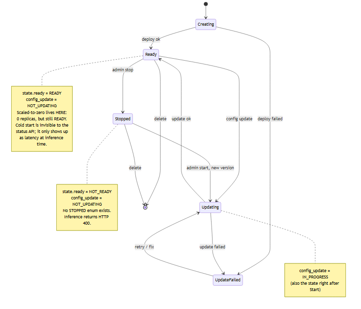

# genai-coldstart-guard

Making a Databricks GenAI endpoint say "I'm warming up" instead of "the system is down."

## The problem this solves

A chat application was telling users **"Sorry, the system is down"** when the system was not down. Their Databricks GenAI serving endpoint runs with scale-to-zero enabled to save cost in lower environments, so the first request after an idle period has to wake the endpoint first. That cold start is slow, something upstream times out, and the user-facing layer collapses the timeout into a generic server-down error.

The message is simply wrong, and it erodes trust. The endpoint is starting, not broken. The honest message is closer to:

> The AI service is starting after a period of inactivity. Please try again in about a minute.

This repository is where that bug was investigated and a fix was prototyped safely, before touching the production Java backend.

## Choosing a serving option (cost vs cold start)

Databricks Model Serving has several endpoint types, and their cost/latency trade-offs differ sharply. The core tension: **scale-to-zero saves money but adds a cold start; staying warm removes the cold start but costs more.** Decide it per environment at the start, not after the bill arrives.

A rough guide by goal:

| Your situation | Lean toward |
| --- | --- |
| Latency-critical, budget available | Keep capacity warm: disable scale-to-zero / set provisioned concurrency (custom models) or provisioned throughput (foundation models). No cold start; you pay for always-on. |
| Cost-sensitive, low or bursty volume | Scale-to-zero, and handle the cold start accurately (what this repo does): classify the first-request delay as "starting," not "system down." |
| Using a base foundation model | Foundation Model APIs - pay-per-token for low volume (no infra, no cold start); provisioned throughput when you need guaranteed performance. |
| Calling a third-party model | External models: a governed proxy. No Databricks cold start; cost and latency are the provider's. |
| A non-model service (routing, APIs, glue code) | Don't host it on Model Serving - it pays the cold-start tax for no model-serving benefit. Host it on **Databricks Apps** (in-perimeter) or a container platform; keep Databricks for models + vector indexes. |

The detail behind these choices lives in the docs: [Apps vs Model Serving](docs/databricks-apps-vs-model-serving.md) (cost vs cold start, with sources), [Latency axes](docs/databricks-latency-axes.md) (the performance fixes), and [the endpoint state model](docs/databricks-endpoint-states.md) (the full endpoint-type taxonomy).

> Databricks' serving options evolve quickly; newer runtimes or announcements may post-date the docs cited here. Treat this as the documented baseline and verify current options for your workspace.

## What this repository is (and is not)

This is a behaviour-validation harness plus a thin facade prototype. It does two jobs:

1. Reproduce and classify every state a Databricks serving endpoint can be in (warm, scaled-to-zero/cold, stopped, updating, errored) so the real backend behaviour is understood rather than guessed.
2. Prototype a facade that turns those states into honest, safe user messages while preserving the existing API contract.

It is not a product, a framework, or a general GenAI gateway. It is a focused sandbox for one specific production bug. The eventual fix may live in a production Java backend; this POC exists to measure the real behaviour and prove the classification first.

## Why the cold start is invisible until you hit it

This is the heart of the bug, validated against Databricks docs: a scaled-to-zero endpoint still reports `state.ready = READY`. The status API cannot tell you that the next call will be slow. The cold start only surfaces as latency at inference time, which is exactly why a naive caller mistakes it for an outage. Meanwhile a genuinely stopped endpoint reports `NOT_READY` and returns HTTP 400, and an updating one reports `config_update = IN_PROGRESS`. Same "no answer right now", three very different causes.



The per-state classification table, the facade decision flow, and a traceability table mapping each Swagger example to a Databricks state and source document are in [docs/databricks-endpoint-states.md](docs/databricks-endpoint-states.md).

## Solution space: what we considered and what we shipped

Improving the cold-start experience was one point on a spectrum, from "just classify the state accurately" to "re-architect for streaming". Mapping the whole space first kept the first fix small. **This release ships Option A** - check status, call inference once, return an accurate "starting" message, no retry. Options B through G (bounded retry, async polling, a warm-up endpoint, streaming, always-warm capacity) are the upgrade path, taken only when measured behaviour justifies the extra moving parts.

The full option breakdown is in [ADR-0001](docs/adr/ADR-0001-cold-start-facade-poc.md) and [the research document](docs/research/databricks-cold-start-facade-research.md); copy-paste refactor prompts for testing each one are in [docs/cold-start-experiments.md](docs/cold-start-experiments.md).

## Quick start (mock mode, no Databricks needed)

```bash
python -m venv .venv
source .venv/bin/activate            # Windows: .venv\Scripts\activate
pip install -e ".[dev]"
cp .env.example .env
uvicorn app.main:app --reload --port 8080
```

Open the Swagger UI at [localhost:8080/docs](http://localhost:8080/docs) to explore the contract interactively.

Mock mode simulates every endpoint state without a real Databricks connection. For example, watch a cold start get classified honestly:

```bash
curl -s -X POST http://localhost:8080/agentservice/agent/chat \
  -H "Content-Type: application/json" \
  -d '{"conversation_id":"demo","route":"mock:cold_start_timeout","messages":[{"role":"user","content":"Hello"}]}'
```

To exercise all simulated states at once, run `bash scripts/curl_examples.sh` (the full route list lives in that script).

## Pointing at a real Databricks endpoint

Set `BACKEND_MODE=databricks` and the `DATABRICKS_*` variables in `.env`, then call the same path. The facade reads endpoint status, calls inference once, and classifies the outcome into a safe message. All variables are documented in [.env.example](.env.example); what each classified response means is in [docs/databricks-endpoint-states.md](docs/databricks-endpoint-states.md).

## Documentation

- [docs/databricks-endpoint-states.md](docs/databricks-endpoint-states.md) - the validated endpoint state model, cold-start classification, and the state/decision diagrams.
- [docs/databricks-apps-vs-model-serving.md](docs/databricks-apps-vs-model-serving.md) - where to host a non-model service: cost vs cold start, Apps vs Model Serving (fact-checked, with sources).
- [docs/databricks-latency-axes.md](docs/databricks-latency-axes.md) - performance anti-patterns for a request-serving app, and their Databricks-native fixes.
- [docs/databricks-performance-monitoring.md](docs/databricks-performance-monitoring.md) - how to MEASURE where a serving request spends its time (stdlib timing, MLflow Tracing, cProfile) so you optimise the axes above by data, not guesswork.
- [docs/databricks-storage-analytical-vs-transactional.md](docs/databricks-storage-analytical-vs-transactional.md) - the OLAP-vs-OLTP distinction the Databricks names hide: Delta / lakehouse / warehouse (analytical) vs Lakebase / Postgres (transactional), and which to use for sessions, logs, and hot-path state.
- [docs/cold-start-experiments.md](docs/cold-start-experiments.md) - the full option space (A-G) and copy-paste refactor prompts.
- [docs/adr/ADR-0001-cold-start-facade-poc.md](docs/adr/ADR-0001-cold-start-facade-poc.md) - the architecture decision record.
- [docs/research/databricks-cold-start-facade-research.md](docs/research/databricks-cold-start-facade-research.md) - the original investigation.

## Safety

Do not commit `.env`. Do not log tokens. Do not expose raw Databricks errors to users.
