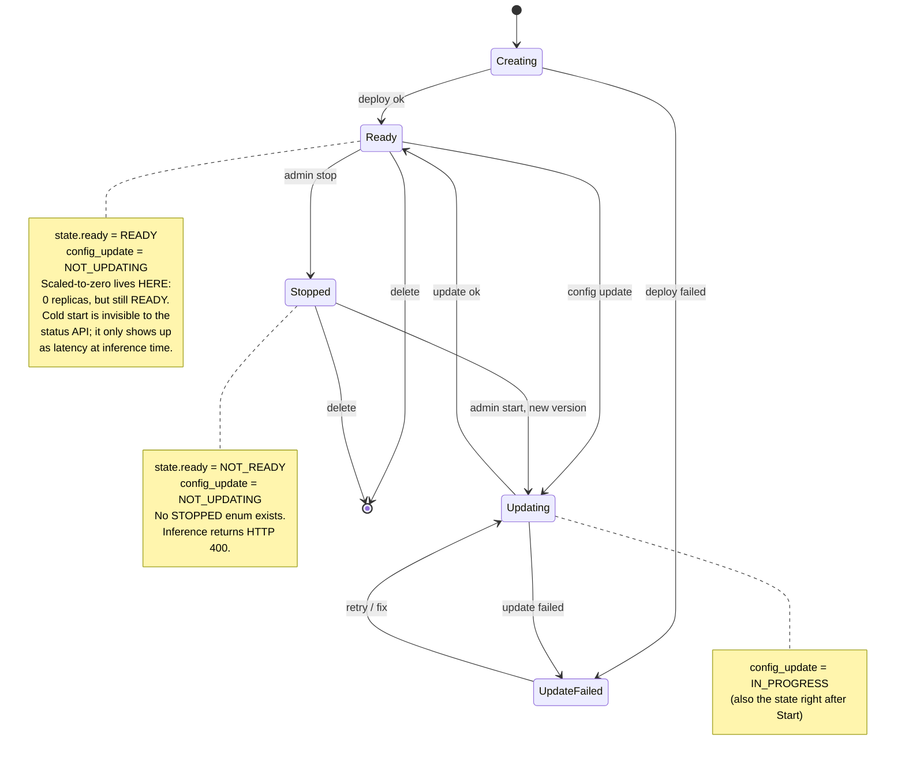
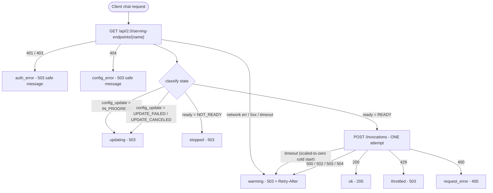

# Databricks serving endpoint states: what client code actually experiences

Validated against Databricks docs on 2026-06-26 (see sources at bottom). Target deployment is the **AWS flavor** of Databricks. The serving-endpoints REST API, the state enums, and the stopped/scale-to-zero behaviour described here are identical across AWS, Azure, and GCP; only the docs URLs differ. This is the behavioural reference for the facade and a visual scratchpad to check the middle-tier API against while wiring the real endpoint.

## The one thing to internalize

The serving endpoint `state` object has exactly **two** fields:

| Field | Values |
|---|---|
| `state.ready` | `READY`, `NOT_READY` |
| `state.config_update` (older name: `state.update_state`) | `NOT_UPDATING`, `IN_PROGRESS`, `UPDATE_FAILED`, `UPDATE_CANCELED` |

There is **no `STOPPED` value**. The UI label "Not ready (Stopped)" is a presentation-layer composition, not an API enum. This is the single most important correction to the original research: you cannot detect "stopped" by looking for the word "STOPPED" in the status payload.

`scale_to_zero_enabled` is a per-served-entity config flag (`config.served_entities[].scale_to_zero_enabled`), not a state. Scaling to zero does **not** change `state.ready` - the endpoint keeps reporting `READY` while running zero replicas.

## How each real-world condition maps to observable signals

| Condition | `state.ready` | `state.config_update` | Inference (`POST /invocations`) | Facade classification |
|---|---|---|---|---|
| Warm and serving | `READY` | `NOT_UPDATING` | 200, fast | `ok` |
| Scaled to zero (idle) | `READY` | `NOT_UPDATING` | slow / may time out on first call | `ok` if it returns in time, else `warming` |
| Deploying / config update | `NOT_READY` or `READY` | `IN_PROGRESS` | may fail | `updating` |
| Update failed | `READY` or `NOT_READY` | `UPDATE_FAILED` | old config may still serve | `updating` (or `unavailable`) |
| Manually stopped | `NOT_READY` | `NOT_UPDATING` | **400** | `stopped` |
| Auth/permission problem | n/a (status call 401/403) | n/a | n/a | `auth_error` (safe 503 to user) |
| Wrong/deleted endpoint | n/a (status call 404) | n/a | n/a | `config_error` (safe 503 to user) |
| Throttled | `READY` | `NOT_UPDATING` | 429 | `throttled` |

Key consequence: **stopped and scaled-to-zero are only cleanly distinguishable by behaviour, not by status.** Stopped shows `ready:NOT_READY` and inference 400; scaled-to-zero shows `ready:READY` and inference is just slow. The status API alone cannot tell you whether the next inference call will be fast.

Caveat to verify on the real endpoint tomorrow: the `400`-on-stopped behaviour is documented, but Databricks docs do not publish a JSON example proving a stopped endpoint reports `config_update: NOT_UPDATING`. Treat `config_update: NOT_UPDATING` for stopped as expected-but-unconfirmed. The reliable signals are: `ready: NOT_READY` (with `config_update` not `IN_PROGRESS`) plus the inference `400`. Capture the actual stopped-endpoint status JSON during validation and update this row.

## Diagram 1: Endpoint lifecycle (Databricks side)



## Diagram 2: Facade decision flow (what the middle tier does per request)



## How classify_state works (and the bug that was fixed)

The original `app/databricks_client.py` `classify_state()` detected stopped by string-matching:

```python
raw_text = " ".join([ready, update_state, config_update, str(state)]).upper()
if "STOPPED" in raw_text:
    return "stopped"
if "UPDATING" in raw_text or "NOT_READY" in raw_text:
    return "updating"
if ready == "READY":
    return "ready"
return "updating"
```

Because the API never emits "STOPPED", a stopped endpoint (`ready:NOT_READY`, `config_update:NOT_UPDATING`) skipped the first check, matched `NOT_READY` in the second, and returned `"updating"` - the wrong label (though still a safe 503). This is now **fixed**: `classify_state()` keys off the real fields, in this order:

```python
if config_update == "IN_PROGRESS":
    return "updating"
if config_update in {"UPDATE_FAILED", "UPDATE_CANCELED"}:
    return "updating"          # or a distinct "unavailable"
if ready == "NOT_READY":
    return "stopped"           # NOT_READY + not updating == stopped
if ready == "READY":
    return "ready"
return "updating"              # unknown: stay conservative, never serve blindly
```

The inference 400 path remains the runtime confirmation of stopped: if the status read was stale and we call a stopped endpoint, the 400 still routes to `request_error`; logs capture the truth.

### Code-vs-target status

The classification table above is the **target** model. Status of the three known deltas:

1. **Stopped detection** - FIXED. `classify_state()` now keys off `ready`/`config_update` (code above); a stopped endpoint is labeled `stopped`. Covered by `tests/test_classify_state.py`.
2. **429 throttled** - still folded into `warming_response()` (the table targets a distinct `throttled`). Acceptable for now; split it out only if rate-limiting becomes real.
3. **404 not-found** - FIXED. `handle_databricks_chat` now has an explicit `404` branch returning a safe 503 (config error in logs).

## Stop/start REST endpoints (for test fixtures tomorrow)

```
POST /api/2.0/serving-endpoints/{name}/config:stop
POST /api/2.0/serving-endpoints/{name}/config:start
```

Start creates a **new config version**, so immediately after Start you will observe `config_update: IN_PROGRESS` (-> facade `updating`) before it reaches `READY`. Plan your latency measurements around that.

## Sources

- [Manage model serving endpoints, AWS](https://docs.databricks.com/aws/en/machine-learning/model-serving/manage-serving-endpoints) (stop/start, 400 on stopped, statuses)
- [Serving endpoints REST API, GET state schema](https://docs.databricks.com/api/workspace/servingendpoints/get) (cloud-agnostic)
- [Databricks SDK serving dataclasses](https://databricks-sdk-py.readthedocs.io/en/latest/dbdataclasses/serving.html) (exact enum values)
- [Debug model serving timeouts](https://docs.databricks.com/aws/en/machine-learning/model-serving/model-serving-timeouts)
